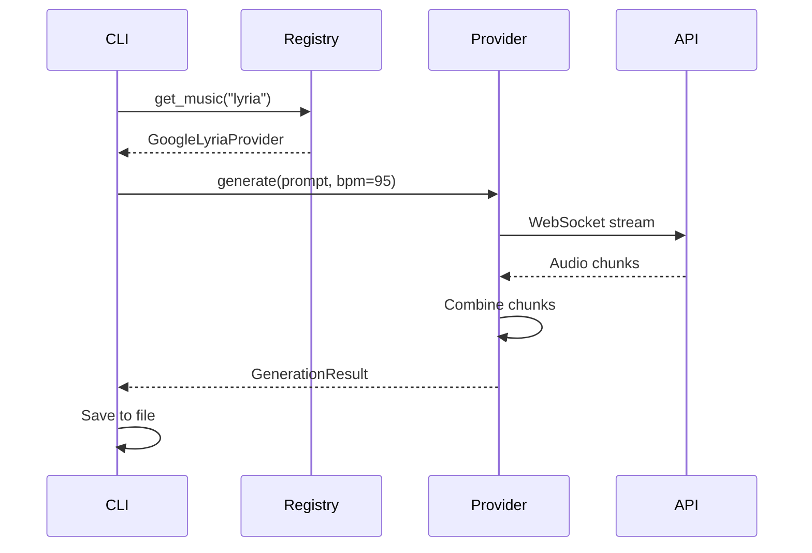
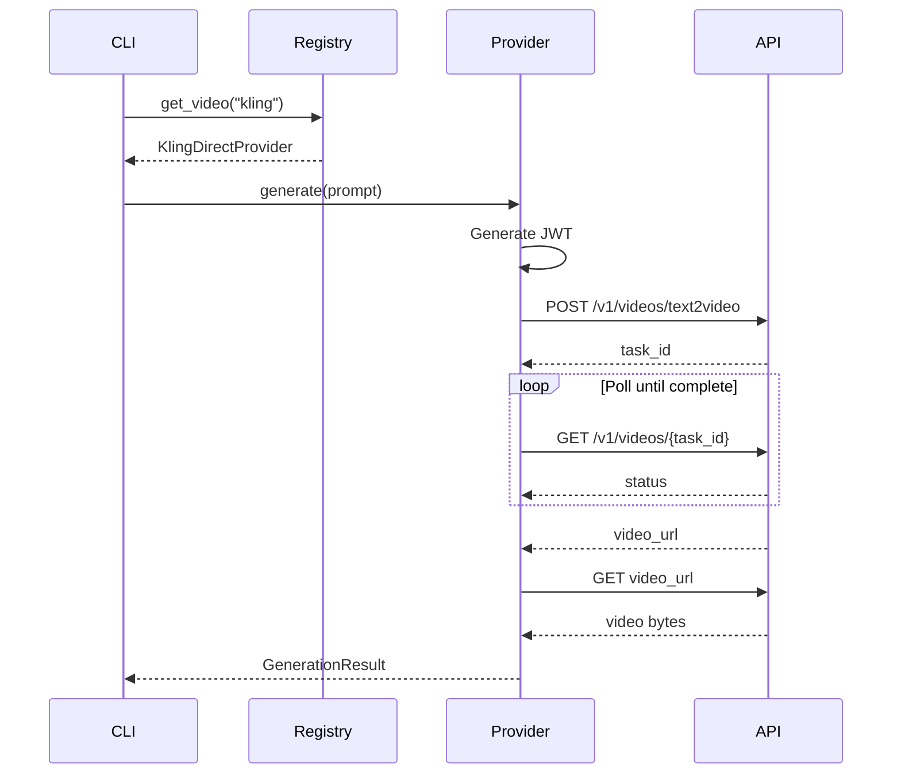

# AI Content Package Architecture

## Overview

The `ai_content` package is a multi-provider AI content generation framework designed for extensibility, type safety, and async-first operation.

```
┌─────────────────────────────────────────────────────────────────┐
│                         CLI / User Code                          │
└────────────────────────────────┬────────────────────────────────┘
                                 │
┌────────────────────────────────▼────────────────────────────────┐
│                        ProviderRegistry                          │
│  ┌──────────┐  ┌──────────┐  ┌──────────┐  ┌──────────┐        │
│  │  lyria   │  │  minimax │  │   veo    │  │  kling   │  ...   │
│  └────┬─────┘  └────┬─────┘  └────┬─────┘  └────┬─────┘        │
└───────┼─────────────┼─────────────┼─────────────┼───────────────┘
        │             │             │             │
┌───────▼─────────────▼─────────────▼─────────────▼───────────────┐
│                        Provider Protocol                         │
│            MusicProvider / VideoProvider / ImageProvider         │
└─────────────────────────────────────────────────────────────────┘
        │             │             │             │
┌───────▼─────┐ ┌─────▼────┐ ┌─────▼────┐ ┌─────▼─────┐
│ Google APIs │ │ AIMLAPI  │ │Google API│ │ Kling API │
│  (genai)    │ │  (httpx) │ │  (genai) │ │   (httpx) │
└─────────────┘ └──────────┘ └──────────┘ └───────────┘
```

## Design Principles

### 1. Protocol-Based Interfaces
We use Python's `Protocol` (PEP 544) for structural subtyping:

```python
@runtime_checkable
class MusicProvider(Protocol):
    @property
    def name(self) -> str: ...
    async def generate(self, prompt: str, **kwargs) -> GenerationResult: ...
```

**Why?** Protocols enable duck typing with full type safety. Any class implementing the required methods satisfies the protocol without inheritance.

### 2. Registry Pattern
Providers self-register via decorators:

```python
@ProviderRegistry.register_music("lyria")
class GoogleLyriaProvider:
    ...
```

**Why?** This enables:
- Dynamic discovery of available providers
- Plugin architecture for third-party extensions
- No central file that lists all providers

### 3. Async-First
All I/O operations are async:

```python
async def generate(self, prompt: str) -> GenerationResult:
    async with httpx.AsyncClient() as client:
        response = await client.post(...)
```

**Why?** Enables:
- Concurrent provider calls
- Non-blocking operations
- Better resource utilization

### 4. Result Objects
We return `GenerationResult` instead of raising exceptions:

```python
@dataclass
class GenerationResult:
    success: bool
    provider: str
    content_type: str  # "music", "video", "image"
    file_path: Path | None = None
    error: str | None = None
```

**Why?** 
- Explicit success/failure handling
- Consistent return type for all providers
- Easier to aggregate results from multiple providers

## Package Structure

```
src/ai_content/
├── core/                 # Foundational abstractions
│   ├── provider.py       # Protocol definitions
│   ├── registry.py       # Provider registration
│   ├── result.py         # GenerationResult dataclass
│   └── exceptions.py     # Custom exceptions
│
├── config/               # Configuration management
│   ├── settings.py       # Pydantic settings
│   └── loader.py         # YAML config loading
│
├── providers/            # Provider implementations
│   ├── google/           # Google native (Lyria, Veo, Imagen)
│   ├── aimlapi/          # AIMLAPI providers (MiniMax)
│   └── kling/            # Direct KlingAI API
│
├── presets/              # Style presets
│   ├── music.py          # Music style presets
│   └── video.py          # Video style presets
│
├── pipelines/            # Orchestration (future)
│
├── utils/                # Shared utilities
│
└── cli/                  # Command-line interface
    └── main.py           # Typer CLI
```

## Data Flow

### Music Generation Flow



### Video Generation Flow



## Extension Points

### Adding a New Provider

1. Create provider file:
```python
# src/ai_content/providers/newprovider/music.py
from ai_content.core.registry import ProviderRegistry
from ai_content.core.result import GenerationResult

@ProviderRegistry.register_music("newprovider")
class NewMusicProvider:
    name = "newprovider"
    supports_vocals = True
    supports_realtime = False
    supports_reference_audio = True
    
    async def generate(self, prompt: str, **kwargs) -> GenerationResult:
        # Implementation
        ...
```

2. Import in `__init__.py` to trigger registration
3. Provider is now available via `ProviderRegistry.get_music("newprovider")`

### Adding a New Preset

1. Add to `src/ai_content/presets/music.py`:
```python
AFROBEATS = MusicPreset(
    name="afrobeats",
    prompt="[Afrobeats] [Talking drums, Highlife guitar]...",
    bpm=105,
    mood="energetic",
    tags=["afrobeats", "highlife", "african"],
)

# Add to registry
MUSIC_PRESETS["afrobeats"] = AFROBEATS
```

## Configuration

### Environment Variables

| Variable | Provider | Required |
|----------|----------|----------|
| `GEMINI_API_KEY` | Google (Lyria, Veo, Imagen) | Yes for Google |
| `AIMLAPI_KEY` | AIMLAPI (MiniMax) | Yes for AIMLAPI |
| `KLINGAI_API_KEY` | KlingAI Direct | Yes for Kling |
| `KLINGAI_SECRET_KEY` | KlingAI Direct | Yes for Kling |

### YAML Configuration

```yaml
# configs/default.yaml
project:
  name: "AI Content Generator"
  output_dir: "./exports"

google:
  video_model: "veo-3.1-generate-preview"
  music_bpm: 120
  music_duration_seconds: 30

aimlapi:
  music_model: "minimax/music-2.0"
  poll_interval: 10
```

## Testing Strategy

### Unit Tests
- Mock all external API calls
- Test each provider in isolation
- Cover success and failure paths

### Integration Tests
- Use recorded responses (VCR pattern)
- Test provider registration
- Test end-to-end CLI commands

### Property-Based Tests
- Use Hypothesis for edge cases
- Test result dataclass invariants
